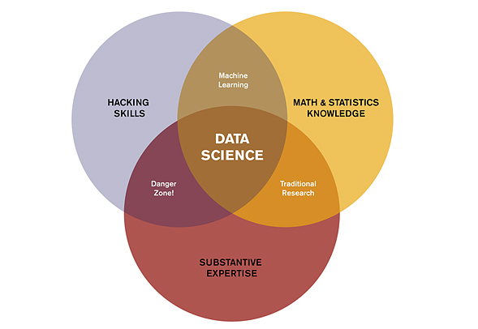
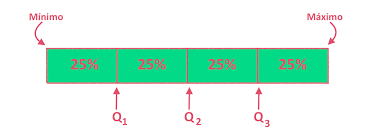
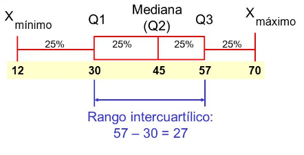

```{r setup, include=FALSE}
knitr::opts_chunk$set(echo = TRUE)
```

# Objetivo principal

<center>

</center>


# Estadística

Matemática aplicada que permite interactuar con un conjunto de datos, además de facilitar las labores de recolección, resumen, comparación y generalización de resultados.

## Estadística descriptiva

> **Análisis exploratorio de datos**, se contituye como herramienta fundamental de cualquier análisis de tipo inferencial que proporciona elementos estadísticos que permiten la **visualización** y **representación objetiva** de la información.

### Objetivos

* Evaluar la calidad y consistencia de los datos.

* Determinar la distribución de las variables en estudio.

* Desplegar posibles patrones de comportamiento de los datos.

* Aplicar el tratamiento de datos ausentes.

* Detectar datos atípicos. (Outlier)

* Comprobar supuestos
    * normalidad
    * linealidad
    * homocedasticidad

## Estadística inferencial

La estadística inferencial o deductiva se encarga de realizar **generalizaciones en poblaciones**, a partir de información obtenida de una muestra.

### Objetivos

* Estimación de parámetros
    * estimación puntual
    * estimación por intervalos

* Contraste de hipótesis
    * hipótesis nula
    * hipótesis alternativa

## Resumen

<center>
|**Descriptiva**|**Inferencial**|
|:---|:---|
|Resumen de información|Generalización de resultados|
|Variables cualitativas, cuantitativas|Variables cualitativas, _cuantitativas_|
|Medidas de resumen, tablas, gráficos|Estimación de parámetros, contraste de hipótesis|
|Formular hipótesis|Rechazar o No, la hipótesis|

</center>


# Conceptos

## Población ($N$)

* Conjunto de elementos acotados en tiempo y espacio (para intereses específicos) con alguna característica medible o cuantificable.

* Conjunto de individuos con una o más características en común.

*  Conjunto de todos los posibles resultados en la medición de un fenómeno.

## Muestra ($n$)

Cualquier subconjunto de elementos o  individuos pertenecientes a una población cuya principal idea es que sea representativa.

La teoría del [muestreo](https://es.wikipedia.org/wiki/Muestreo_(estad%C3%ADstica)) define los fundamentos probabilísticos, distribuciones estadísticas, métodos o técnicas de selección, fórmulas de cálculo matemático de los errores muestrales, tablas y determinación del tamaño de muestra. Indica los procedimientos para extraer un muestra del colectivo bajo estudio con la finalidad de analizar e inferir algo de la población o del universo total.

Ahorra tiempo, dinero y se pueden obtener muestras más precisas.

## Parámetro

__Valor de la población__ sobre el que se desea realizar inferencia a partir de estadísticos obtenidos de la muestra que denominan estimadores.

## Estadístico

Cualquier medida relaizada sobre los valores de una variable.

## Estimadores

Medidas de resumen que se calculan con el propósito de describir y caracterizar una muestra. Expresión matemática que permite cuantificar la estimación.

Una buena estimación se caracteriza por:

* No tener sesgo
* Alto grado de precisión
* Alto nivel de exactitud

## Hipótesis

Supuestos que se hacen respecto a un parámetro o estadistico, como la media, proporción, desviación estándar, varianza.

## Error muestral

También denominado error de estimación, determinado en gran medida por la observación y medición de variables en una muestra de la población completa.

## Modelo

Conjunto de supuestos o presuposiciones acerca del fenómeno bajo estudio. Un modelo se puede definir como una abstracción matemática que describe un fenómeno del mundo real.


## Individuo

Cualquier individuo que porte información sobre el fenómeno bajo estudio.

# Variables

Características de interés que se pretende analizar en un individiuo o grupo de individuos.


## Tipos de variable

* Cualitativas
    * dicotómicas
    * politómicas


* Cuantitativas
    * discretas
    * continuas

## Variables [cualitativas](https://www.lifeder.com/variable-cualitativa/)

Una variable cualitativa, también llamada variable categórica, es la que toma en consideración una característica. Su función es la expresión de cualidades o peculiaridades de personas, objetos o situaciones que no tienen carácter numérico.

## Según la cantidad de variables

* _Dicotómicas_: aquellas que pueden tomar sólo dos valores, como el género de una persona (femenino y masculino).

* _Politómicas_: aquellas que se caracterizan más de dos valores.

## Según la naturaleza de la variable

* _Binaria_: valores denotados por cero y uno (0 ,1). Por ejemplo para categorizar un diagnóstico de una enfermedad; para un diagnóstico positivo se puede denotar como $1$, mientras que uno negativo será denotado por el $0$.

* _Nominal_: no responden a un orden en específico. Los colores son un ejemplo. (Verde, blanco, azul...)

* _Ordinal_: responden a un orden en particular según la naturaleza de la variable. El grado de satisfacción de un cliente frente a la atención de los empleados de cierta cadena supermercados. (Bajo, medio, alto).


## Variables [cuantitativas](https://enciclopediaeconomica.com/variable-cuantitativa/)


Son aquellas variables que otorgan un resultado representado por un valor numérico.

* _Discreta_: variable que no puede tomar valores intermedios entre dos valores consecutivos. Dicho de otra manera son variables que toman valores enteros. Ejemplos de esta variable es el número de hijos, el número de empleados, cantidad de cuentas bancarias. (1, 2, 3, 4).

* _Continua_: variable que puede tomar cualquier valor dentro de un intervalo, es decir los valores pueden ser representados por números decimales. Como ejemplo, el peso (87.65 Kg) o la estatura de una persona (179.21 cm). Cuando el cero representa una ausencia de la característica, como por ejemplo la longitud (0 cm), la escalas de medida se conoce como _razón_; por otro lado una escala donde el cero representa un valor para la variable, se conoce como _intervalo_, un ejemplo es la escala de temperatura en grados Celsius, donde el cero (0°) puede representar el punto de congelación del agua y un valor de -10° también respresenta un valor en la escala.


# Estadísticos

Medidas deresumen para una variable.

Caracterizan la información que aportan los $n$ datos de la muestra considerada.

Los estadísticos o valores típicos pretenden __caracterizar o describir la muestra__, indicando el valor de la variable hacia el cual tienden a agruparse los datos.


## Tipos de medida

* **Centralización**
    * media
    * mediana
    * moda

* **Dispersión**
    * desviación estándar
    * varianza
    * rango
    * rango intercuartil

* **Posición**
    * cuartiles
    * deciles
    * percentiles

* **Distribución**
    * asimetría
    * curtosis


# Medidas de tendencia central

## Media ( $\overline{x}$ )

También llamada media aritmética o promedio. Representa el reparto equitativo, el equilibrio, la equidad. Es el valor que tendrían los datos, si todos ellos fueran iguales; también podíra decirse, que es el valor que correspondería a cada uno de los datos de la distribución si su suma total se repartiera por igual.

Matemáticamente se define como:

$$\overline{x} = \frac{\sum_{x = a}^{b} x_i}{n} = \frac{x_1+x_2+...+x_n}{n}$$

Por su naturaleza, la media es susceptible a valores extremos.

Cuando se tinene variables discretas, es posible que el resultado de $\overline{x}$, no pertenezca el conjunto de valores posibles. Ejemplo de eso, es el número de hermanos.


## Mediana ($Me$)

Es el valor central, cuando se ordenan de menor a mayor los valores. La mediana deja por encima y por debajo de ella, el $50%$ de los datos.

No se ve afectada por valores extremos.

* En distribuciones simétricas la media es aproximadamente igual a la mediana.

* En distribuciones con sesgo a la derecha, la media tiende a ser mayor que la mediana

* En distribuciones con sesgo a la izquierda la media tiende a ser mayor que la mediana.


## Moda ($Mo$)

La moda es el valor que ocurre con mayor frecuencia, es decir el dato que más se repite.

* Moda
    * unimodal
    * bimodal
    * multimodal


## Media ponderada($Mp$)

Es una medida apropiada cuando en un conjunto de datos cada uno de ellos tiene una importancia relativa (o peso) respecto a los demás datos. Se obtiene multiplicando cada uno de los datos por su ponderación (peso) para luego sumarlos, obteniendo así una suma ponderada, después se divide esta, entre la sima de los pesos.


# Medidas de dispersión

Expresan el grado de homogeneidad de los datos en torno a un valor central.

## Rango

Es la diferencia entre el valor máximo y el valor mínimo.


## Varianza ($S^{2}$)

Representa la variabilidad de una serie de datos respecto a su media. Se define como la suma de los cuadrados de las diferencias entre cada valor de la muestra y su media.

* Población:

$$\sigma^2 = \frac{\sum_{i = 1}^{n}(x_i - \overline{x})^2}{N}$$

* Muestra

$$S^2 = \frac{\sum_{i=1}^{n}(x_1- \overline{x})^2}{n-1}$$

## Desviación estándar ($S$)

Se usa para cuantificar la variación o dispersión de un conjunto de datos numéricos.

Una desviación estándar baja indica que la mayor parte de los datos de una muestra, tienden a estar agrupados cerca de su media aritmética, mientras que un valor alto para la desviación estándar, indica que los datos se extienden sobre un rango de valores más amplio.

* Población

$$\sigma = \sqrt{\sigma^2}$$

* Muestra

$$S = \sqrt{S^²}$$

$\underline{Tiene\space la\space particularidad\space de\space estar\space definida\space en\space las\space mismas\space unidades\space de\space la\space variable\space analizada\space}.$


## Coeficiente de variación ($CV$)

Cociente entre la desviación típica y la media aritmética, expresado en porcentaje.

$$CV = \frac{S}{\overline{x}}*100$$

Es una interpretación relativa del grado de variabilidad independiente de la escala de la variable.

A mayor valor del $CV$, mayor heterogeneidad de los valores de la variable; y a menor $CV$, mayor homogeneidad de los valores de la avariable.


# Medidas de posición

Percentiles, cuantiles y deciles, indican la posición relativa de un dato respecto al resto de la muestra.


## Percentiles

Dividen la muestra en 100 partes iguales. Son los valores que dejan determinado porcentaje de observaciones por debajo de ellos.

Ubicación del percentil:

$$P_k = \frac{k(n+1)}{100}$$

## Deciles

Dividen la muestra en 10 partes iguales.

Ubicación del percentil:

$$P_k= \frac{k(n+1)}{10}$$

## Cuartiles

Dividen la muestra en cuatro partes iguales

* Cuartil 1:
    * 25% de las observaciones

* Cuartil 2:
    * 50% de las observaciones

* Cuartil 3:
    * 75% de las observaciones  

<center>    
  
</center>

Ubicación del cuartil:

$$Q_k = \frac{k(n+1)}{4}$$

Donde se ubica el mínimo valor, es el límite inferior ($L_i$); y para la posición del máximo valor se tiene el límite superior ($L_s$).


### Rango intercuartil (RIQ)

El rango intercuartílico se obtiene como la diferencia entre los cuartiles $Q_3$ y $Q_1$. La mitad de las observaciones se clasifican dentro de este rango.

Ejemplo:

<center>
  
</center>


# Medidas de distribución o forma

Indican la simetría de la distribución de una variable respecto a la media aritmética, sin necesidad de hacer la representación gráfica.

Los coeficientes de asimetría indican si hay el mismo número de elementos a la izquierda y derecha de la media.

## Coeficiente de asimetría

Distribución simétrica ($g_1$): indica el grado de simetría de la distribución de datos.

* Disribución simétrica: $g_1=0$

* Disribución asimétrica negativa: $g_1<0$

* Disribución asimétrica: $g_1>0$

Su representación matemática:

$$g_1 = \frac{n}{(n-1)(n-2)}*\frac{\sum_{i=1}^{n}(x_i- \overline{x})^3}{S^3}$$


## Coeficiente de Curtosis ($g_2$)

Evalúa el grado de concentración de los datos alrededor de la media y de los extremos o colas.

* Distribución mesocúrtica: $g_2=0$
* Distribución leptocúrtica: $g_2>0$
* Distribución platicúrtica: $g_2<0$

$$g_2 = \frac{n(n+1)}{(n-1)(n-2)(n-3)} * \frac{\sum_{i=1}^{n}(x_1 - \overline{x})^4}{S^4} - \frac{3(n-1)^2}{(n-2)(n-3)}$$


# Referencias

* https://www.lifeder.com/variable-cualitativa/

* https://bookdown.org/aquintela/EBE/variables-discretas-y-continuas.html

* https://bioestadistica.github.io/

* http://geogebra.es/cvg_primaria/05/html/mediana.html

* https://estadisticalidia.com/tema-2-parte-2-medidas-de-posicion/

* https://www.google.com/url?sa=i&url=https%3A%2F%2Fslideplayer.es%2Fslide%2F10266389%2F&psig=AOvVaw3Z5uxw2HWVqk-mCjq0mWXr&ust=1581710858770000&source=images&cd=vfe&ved=0CAIQjRxqFwoTCNjExKuqz-cCFQAAAAAdAAAAABAE
